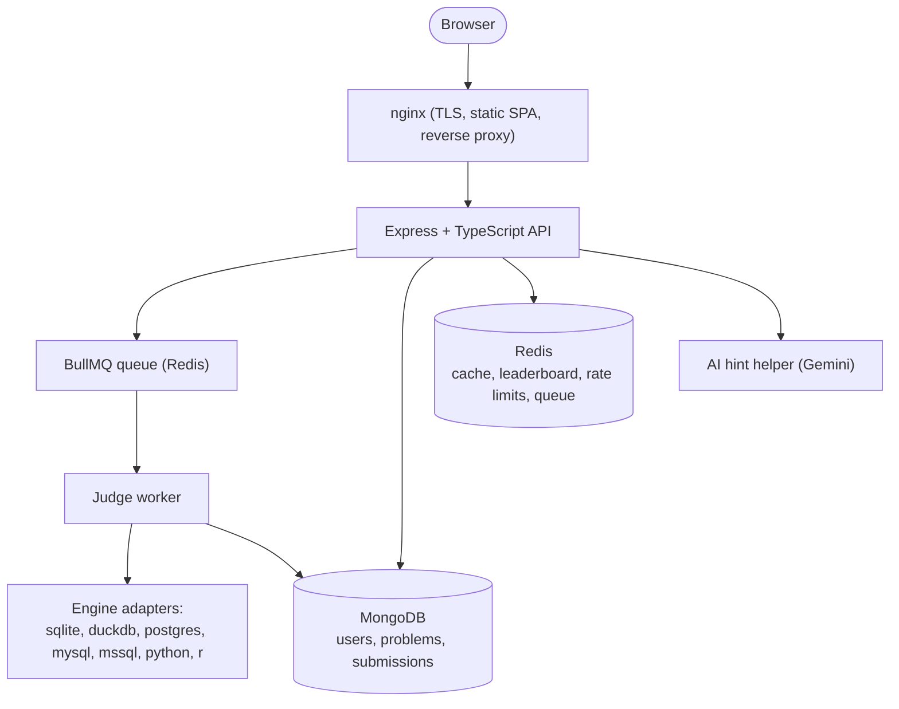
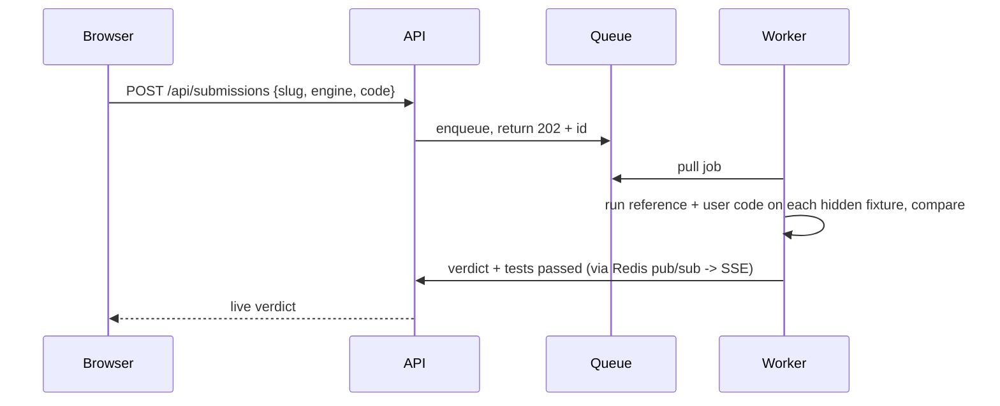

# DataDojo - High-Level Design

## Overview

DataDojo is an online judge for data skills. A user picks a problem, writes a
query or script in the browser, and the server runs it against hidden test data
and returns a verdict. Problems can be solved in five SQL dialects, in Python
(pandas), or in R.

Two parts:

- A build-time pipeline (`kb/`, `content/`) that turns book content and generated
  datasets into verified problems, run once and seeded into the database.
- A runtime app that serves problems and judges submissions.

## Architecture

## Components

- nginx: terminates TLS (Let's Encrypt), serves the built SPA, proxies `/api`.
- API: auth, problem catalog, submissions, leaderboard, profile, AI hints.
- Queue and worker: a submission is not run inline. It is queued in BullMQ
  (backed by Redis) and picked up by a worker, so a burst of submissions queues
  instead of overloading the API.
- Engine adapters: one interface, seven implementations. SQLite and DuckDB run
  in-process in a worker thread; PostgreSQL, MySQL, and SQL Server run as
  servers; Python and R run as subprocesses.
- MongoDB stores users, problems, and submissions. Redis holds the cache, the
  leaderboard (sorted set), rate-limit counters, and the job queue.

## Request flow: a submission

Run works the same way but executes against the small visible sample and returns
the result table without judging or recording it.

## Isolation and limits

- Each run is fresh: in-process engines use a new in-memory database per run and
  a worker thread that can be killed on timeout; the server engines use a
  transaction that is rolled back; Python and R run in subprocesses killed on
  timeout. A wall-clock limit yields TLE.
- Rate limits (Redis): submissions per minute, AI hints per hour.
- Reference solutions and hidden fixtures are never sent to the client.
- Auth is JWT (short access token in memory, httpOnly refresh cookie). Roles are
  checked on the server. Signup is restricted to trusted email providers.

## Deployment

One server (Ubuntu 24.04, 4 vCPU, 8 GB). Databases, Python, and R run on the
host; the API runs under systemd; nginx serves the SPA and proxies the API;
certbot manages TLS. This is the current setup; containerization and horizontal
scaling are in [Future Work](../FutureWork/README.md).

See [LLD](./LLD.md) for the data model, API, and judge details.
