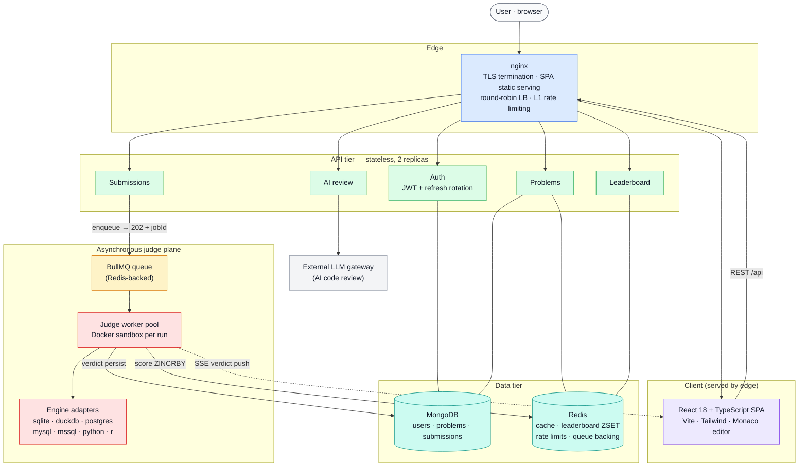
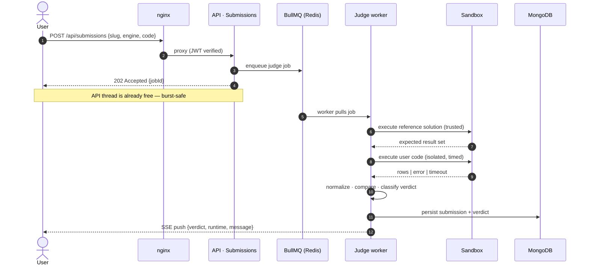
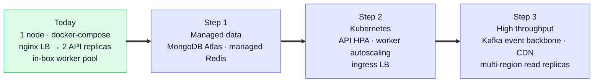

# DataDojo — High-Level Design

| | |
|---|---|
| **Project** | DataDojo — an Online Judge for data skills (SQL, Python, R) |
| **Document** | High-Level Design (HLD) |
| **Version** | 1.0 |
| **Status** | Approved baseline for v1 implementation |
| **Author** | ps-research |
| **Companion** | [Low-Level Design (LLD)](./LLD.md) |

---

## Table of contents

1. [Executive summary](#1-executive-summary)
2. [Context, scope and goals](#2-context-scope-and-goals)
3. [Architectural overview: two planes](#3-architectural-overview-two-planes)
4. [Runtime architecture](#4-runtime-architecture)
5. [Component responsibilities](#5-component-responsibilities)
6. [The submission lifecycle](#6-the-submission-lifecycle)
7. [Security model](#7-security-model)
8. [Capacity plan](#8-capacity-plan)
9. [Scalability path](#9-scalability-path)
10. [Architecture decision log](#10-architecture-decision-log)

---

## 1. Executive summary

DataDojo is a full-stack Online Judge purpose-built for **data roles** — business
analysts, data analysts, data engineers and data scientists. Users solve
analytical problems in **five SQL dialects** (SQLite, DuckDB, PostgreSQL,
MySQL/MariaDB, SQL Server) and **Python/pandas** (R/tidyverse planned), and are
judged automatically against hidden, execution-verified expected results with
verdicts **AC / WA / TLE / RE / CE**.

Two properties distinguish the design:

1. **A separated build plane.** Content is manufactured offline by a five-layer
   ("medallion") knowledge-base pipeline in which every problem traces to an
   authoritative source and every reference solution is **executed on real
   engines before publication**. The runtime never serves unverified content.
2. **An asynchronous judge plane.** Submissions are queued (BullMQ on Redis) and
   consumed by isolated workers, so a burst of submissions degrades to queueing
   latency — never to an outage of the API tier.

The v1 deployment target is a single 4 vCPU / 8 GB cloud server running the full
stack under docker-compose behind nginx with TLS; the architecture maps 1:1 onto
a Kubernetes scale-out without code changes (§9).

## 2. Context, scope and goals

**Market gap.** Practice platforms for data work are scarce and paywalled:
LeetCode's database track locks roughly five of every six problems behind a
subscription. General-purpose judges (Codeforces, HackerRank) center on
algorithmic programming, not analytical SQL or dataframe wrangling.

**Content strategy.** Problems derive from the *SQL Cookbook, 2nd Edition*
(O'Reilly, 2020 — 164 recipes across 14 chapters) as the skill spine, with the
official **PostgreSQL documentation** linked per-concept as the learning
authority. A provenance chain (sha256-hashed verbatim extraction → parsed
structure → executed verification) guarantees fidelity from page to problem.

### Design goals

| # | Goal | Architectural consequence |
|---|------|---------------------------|
| G1 | Trustworthy verdicts | Expected outputs are **computed by executing** a verified reference solution — never hand-typed |
| G2 | Multi-dialect judging | One judge core; pluggable engine adapters behind a uniform interface |
| G3 | Safety under hostile input | Untrusted code runs in a locked-down sandbox; hard wall-clock timeout converts runaway queries into `TLE` |
| G4 | Burst tolerance | Queue-decoupled judging (the classic "thundering herd" mitigation) |
| G5 | Scale without rewrite | Stateless API tier; queue-decoupled workers; externalizable state (MongoDB, Redis) |
| G6 | Provenance | Every problem carries a machine-checkable trail to its source |

### Out of scope for v1

Contests/ratings, plagiarism detection (MOSS), organizations/classrooms, and a
mobile client. None of these are precluded by the architecture.

## 3. Architectural overview: two planes

```mermaid
flowchart LR
    subgraph BUILD["BUILD PLANE — offline content pipeline"]
        SRC["Sources<br/>SQL Cookbook PDF<br/>PostgreSQL 18 docs"]:::src
        BRZ["L0 Bronze<br/>verbatim spans<br/>sha256 provenance"]:::layer
        SLV["L1 Silver<br/>recipes 164 · solutions 415<br/>datasets"]:::layer
        SEM["L2 Semantic<br/>concept DAG"]:::layer
        VER["L3 Verification farm<br/>415 solutions x 5 engines<br/>executed, outputs captured"]:::verify
        GLD["L4 Gold<br/>authored problems<br/>auto-computed hidden tests"]:::gold
        SRC --> BRZ --> SLV --> SEM --> VER --> GLD
    end

    subgraph RUN["RUNTIME PLANE — live application"]
        MDB[("MongoDB<br/>problems seed")]:::db
        APP["DataDojo app<br/>(section 4)"]:::app
        MDB --> APP
    end

    GLD -- "immutable seed export" --> MDB

    classDef src fill:#fef3c7,stroke:#d97706,color:#111827
    classDef layer fill:#e0e7ff,stroke:#6366f1,color:#111827
    classDef verify fill:#dcfce7,stroke:#16a34a,color:#111827
    classDef gold fill:#fde68a,stroke:#b45309,color:#111827
    classDef db fill:#ccfbf1,stroke:#0d9488,color:#111827
    classDef app fill:#f3e8ff,stroke:#9333ea,color:#111827
```

The planes meet only at the seed export. Content quality problems are caught at
build time by the verification farm; the runtime consumes a vetted, immutable
artifact. This mirrors modern data-platform practice (bronze/silver/gold
medallion), which is thematically native to a product that teaches data skills.

## 4. Runtime architecture

## 5. Component responsibilities

| Component | Responsibilities | Key properties |
|-----------|-----------------|----------------|
| **nginx** (edge) | TLS (Let's Encrypt), serves the built SPA, proxies `/api/*`, **round-robins two API replicas**, first-line rate limiting | The only public listener; demonstrable load balancing |
| **API tier** (Express + TypeScript) | Auth, problem catalog, submission intake, leaderboard reads, AI review proxy | Stateless — replicas are interchangeable; sessions live in JWT + Redis |
| **Judge plane** (BullMQ + workers) | Consume submission jobs, execute reference + user code, compare, persist verdicts, push live updates | Decoupled from API; concurrency-capped; horizontal-scale unit |
| **Sandbox** (Docker) | Isolation boundary for untrusted code | `--network none`, read-only FS, dropped capabilities, memory/CPU/PID caps, wall-clock timeout → `TLE` |
| **MongoDB** | Durable documents: users, problems, submissions, solve-state | The system of record |
| **Redis** | Response cache, leaderboard sorted sets, rate-limit counters, queue backing | One dependency, four earned jobs |

## 6. The submission lifecycle

Verdict classification and output normalization rules are specified in the
[LLD §3](./LLD.md#3-judge-subsystem).

## 7. Security model

| Threat | Mitigation |
|--------|-----------|
| Malicious or runaway code | Docker sandbox: no network, read-only FS, `--cap-drop ALL`, PID/memory/CPU limits; wall-clock timeout yields `TLE` (infinite-loop protection) |
| Role escalation from the client | Roles are embedded in server-signed JWTs and re-checked server-side on every admin route; the client is never trusted |
| Credential compromise | bcrypt (cost 10); short-lived access token + httpOnly `SameSite=Strict` refresh cookie with rotation |
| Submission flooding | nginx rate limit (L1) + per-user Redis counters (L2); queue absorbs bursts |
| XSS / injection | Zod validation on every input; helmet security headers; markdown sanitized at render. User SQL only ever touches disposable, per-submission database state |
| Secret leakage | Secrets via environment only; never committed; reference solutions never serialized to the client |

## 8. Capacity plan

Target host: **4 vCPU · 8 GB RAM · 180 GB NVMe** (Vultr, Ubuntu 24.04 LTS).

| Service | Memory budget | Control |
|---------|--------------|---------|
| SQL Server 2022 | 2.5 GB | `memory.memorylimitmb` |
| MongoDB | 0.5 GB | WiredTiger cache cap |
| MariaDB | 0.4 GB | `innodb_buffer_pool_size` |
| PostgreSQL 16 | 0.4 GB | `shared_buffers` + workers |
| Redis | 0.15 GB | `maxmemory` + LRU |
| API x2 + workers | 1.0 GB | Node heap caps |
| nginx + OS + Docker | 0.8 GB | — |
| **Judging headroom** | **~2 GB** | per-run sandbox caps (Python ~150 MB, R ~300 MB) |

Disk: Docker images (Node, Python, R, four DB servers) ≈ 12 GB; MSSQL binaries
≈ 2 GB; data volumes are trivial at this scale. 180 GB leaves an order of
magnitude of slack.

## 9. Scalability path

Deliberately **designed-for, not over-built**. Because the API tier is stateless
and judging is queue-decoupled, each arrow below is a deployment change, not a
rewrite:

The single-node v1 already exercises every seam that the scale-out depends on:
LB across replicas, queue-decoupled workers, externalized state.

## 10. Architecture decision log

| # | Decision | Alternatives considered | Rationale |
|---|----------|------------------------|-----------|
| ADR-1 | TypeScript across API and SPA | JavaScript | Type safety at the judge/API contract boundary; industry hiring signal; parity with strongest peer projects |
| ADR-2 | BullMQ on Redis for async judging | Kafka; inline execution | Kafka needs JVM + broker ops that don't fit one node; inline execution fails G4. BullMQ delivers the same decoupling on infrastructure we already run; Kafka is named as the step-3 upgrade |
| ADR-3 | nginx as the single edge | Apache; cloud LB | Modern default for TLS + static + LB; Apache duplicates the role; cloud LBs arrive with Kubernetes in step 2 |
| ADR-4 | Docker sandbox + per-engine adapters | One-image-per-language (peer approach) | SQL engines are *servers*, not compilers — adapters with transactional isolation fit better and enable 7 engines |
| ADR-5 | Kubernetes shown as scale path only | Deploy k8s now | A working single-node system that scales cleanly beats a half-operated cluster; honesty is a feature of the design |
| ADR-6 | MongoDB as system of record | PostgreSQL for app data | Document shapes (problems with embedded engine variants) fit naturally; MERN is the program's stack requirement |
| ADR-7 | Build/runtime plane separation | Author problems in the live DB | Verification farms and provenance need offline compute; runtime consumes only vetted artifacts |
