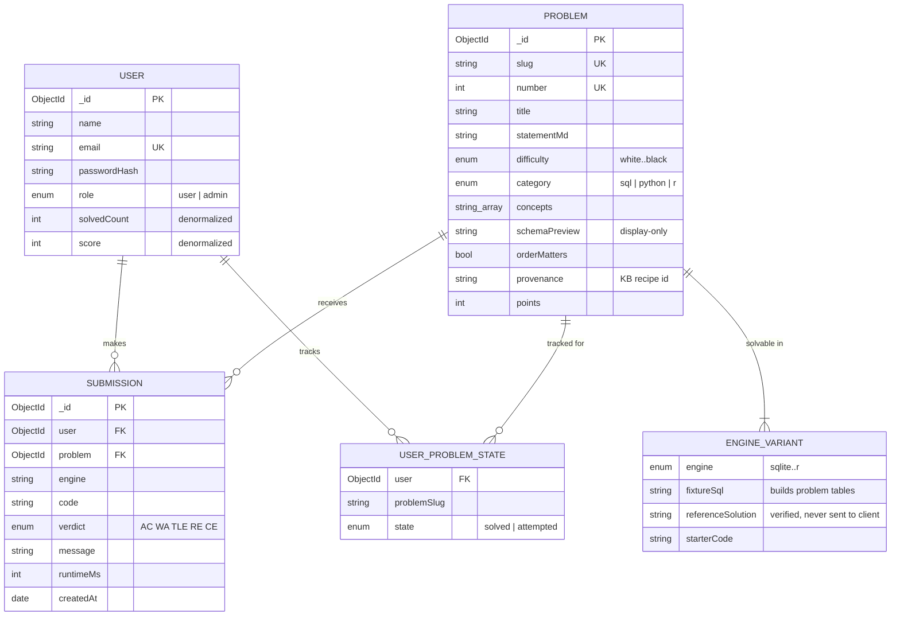
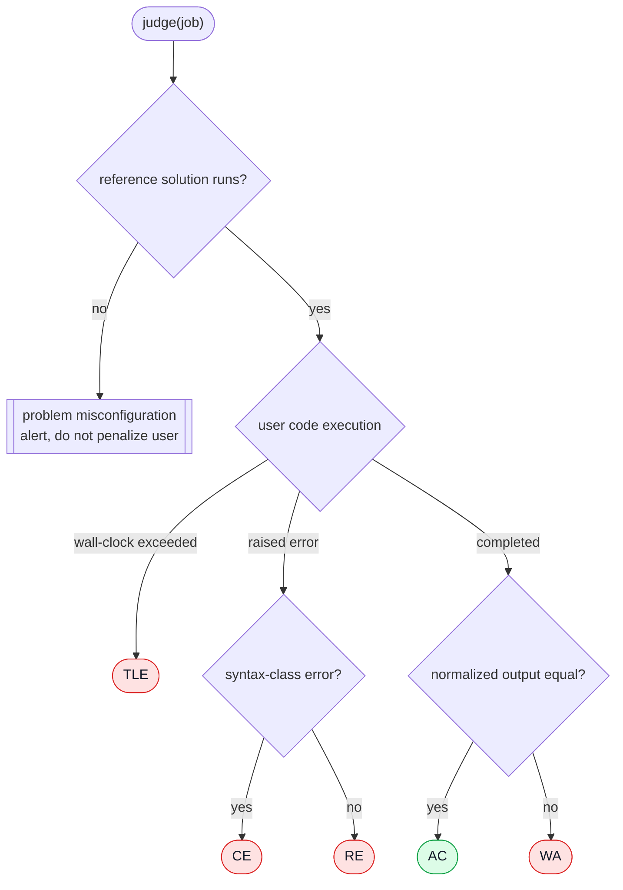
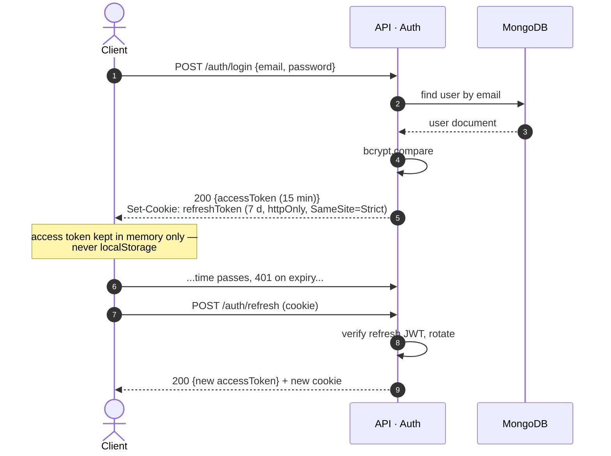
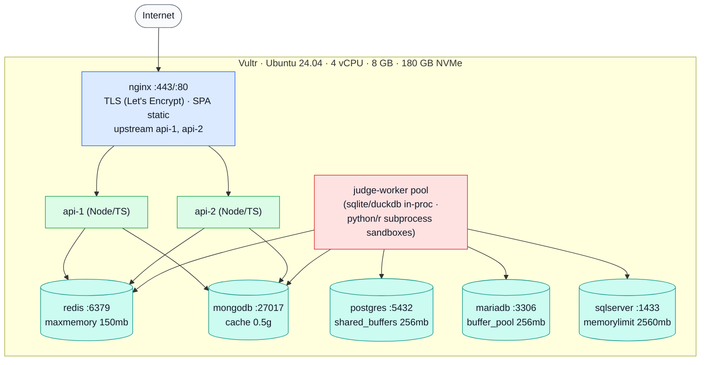

# DataDojo — Low-Level Design

| | |
|---|---|
| **Project** | DataDojo — an Online Judge for data skills (SQL, Python, R) |
| **Document** | Low-Level Design (LLD) |
| **Version** | 1.0 |
| **Status** | Approved baseline for v1 implementation |
| **Author** | ps-research |
| **Companion** | [High-Level Design (HLD)](./HLD.md) |

---

## Table of contents

1. [Data model](#1-data-model)
2. [API contract](#2-api-contract)
3. [Judge subsystem](#3-judge-subsystem)
4. [Authentication flow](#4-authentication-flow)
5. [Caching and rate limiting](#5-caching-and-rate-limiting)
6. [Content pipeline](#6-content-pipeline)
7. [Deployment topology](#7-deployment-topology)
8. [Configuration](#8-configuration)
9. [Error handling conventions](#9-error-handling-conventions)

---

## 1. Data model

### 1.1 Entity relationships (runtime, MongoDB)



**Indexes.** `users.email` unique; `problems.slug` and `problems.number` unique;
`submissions {user, problem, createdAt: -1}` for history views;
`user_problem_state {user, problemSlug}` unique — `state` never downgrades from
`solved`.

**Serialization rule.** `referenceSolution` and full `fixtureSql` are stripped by
the API serializer; the client receives only `engine` and `starterCode` per
variant. This rule is enforced in one place (the problem DTO mapper), not ad hoc.

### 1.2 Knowledge base (build plane, SQLite — implemented)

Five layers in `kb/datadojo_kb.sqlite`:

| Layer | Tables | Contract |
|-------|--------|----------|
| L0 Bronze | `sources`, `raw_spans` | Verbatim text + sha256; append-only; every downstream row FKs to a span |
| L1 Silver | `recipes`, `solutions`, `doc_sections`, `datasets`, `recipe_datasets` | Deterministically parsed structure; parse exceptions recorded per row |
| L2 Semantic | `concepts`, `concept_edges`, `recipe_concepts`, `docsection_concepts` | Prerequisite DAG; acyclicity enforced by pipeline check |
| L3 Verification | `verifications` | One row per solution x engine: status, captured output, engine version |
| L4 Gold | `problems` | Authored, OJ-ready; every row traceable to a recipe and a passing verification |
| Audit | `pipeline_runs` | Stage, counts, exception list per run; empty exception list is the pass criterion |

## 2. API contract

Base path `/api`. Bearer JWT unless marked public. All bodies validated with Zod;
errors follow §9.

| Method | Path | Auth | Request (essentials) | Response (essentials) |
|--------|------|------|----------------------|----------------------|
| POST | `/auth/signup` | public | `{name, email, password≥8}` | `201 {accessToken, user}` + refresh cookie |
| POST | `/auth/login` | public | `{email, password}` | `200 {accessToken, user}` + refresh cookie |
| POST | `/auth/refresh` | cookie | — | `200 {accessToken}` (rotates cookie) |
| POST | `/auth/logout` | public | — | `200`; clears cookie |
| GET | `/auth/me` | JWT | — | `200 {user}` |
| GET | `/problems` | optional | `?difficulty&category&concept&q` | `200 {problems[]}` + `solved` flag when authed |
| GET | `/problems/:slug` | optional | — | `200 {problem}` (no solutions/fixtures) |
| POST | `/submissions` | JWT | `{slug, engine, code}` | `202 {jobId}` |
| GET | `/submissions/:id` | JWT | — | `200 {status, verdict?, message?}` |
| GET | `/submissions?problem=slug` | JWT | — | `200 {submissions[]}` own history |
| GET | `/leaderboard` | public | `?limit=50` | `200 {entries[]}` from Redis ZSET |
| POST | `/ai/review` | JWT | `{submissionId}` | `200 {review}` (rate-limited) |
| POST | `/admin/problems` | JWT admin | problem document | `201` (server-side role check) |

**Realtime.** `GET /api/events` (SSE, JWT): server pushes
`submission:{id}:verdict` events; clients fall back to polling
`GET /submissions/:id`.

## 3. Judge subsystem

### 3.1 Adapter interface

```ts
interface EngineAdapter {
  readonly name: Engine;                       // "sqlite" | ... | "r"
  run(fixture: string, code: string, timeoutMs: number): Promise<RunResult>;
}
type RunResult =
  | { ok: true;  result: { columns: string[]; rows: unknown[][] } }
  | { ok: false; timeout: true }
  | { ok: false; error: string };
```

One judge core drives seven adapters; adding an engine adds a file, not a
redesign.

### 3.2 Isolation and timeout strategy per engine

| Engine | Execution model | Isolation | Timeout mechanism |
|--------|----------------|-----------|-------------------|
| SQLite | in-process (better-sqlite3) | fresh `:memory:` DB per run | worker thread hard-terminate |
| DuckDB | in-process | fresh in-memory DB per run | worker thread hard-terminate |
| PostgreSQL | server | per-run transaction, always `ROLLBACK` | `SET LOCAL statement_timeout` |
| MySQL / MariaDB | server | per-run schema, reload on mutation | `max_execution_time` + kill |
| SQL Server | server | per-run transaction (T-SQL DDL is transactional), `ROLLBACK` | driver query timeout |
| Python / pandas | subprocess (`python -I`) | no site-packages leakage, no network (sandbox netns), rlimits | `SIGKILL` on wall-clock |
| R / tidyverse | subprocess (`Rscript`) | same pattern as Python | `SIGKILL` on wall-clock |

In-process engines execute inside a **worker thread** so the parent can kill a
runaway computation without destabilizing the event loop; server engines rely on
database-native timeouts; subprocess engines are killed by signal. All paths
surface as `TLE`.

### 3.3 Verdict classification



**Normalization rules** (applied to both expected and actual result sets):
`NULL` → sentinel; integer/float unification (`1 == 1.0`, floats rounded to 6
dp); strings trimmed; dates canonicalized to `YYYY-MM-DD`. When
`orderMatters=false`, rows are sorted lexicographically post-normalization so
row order cannot cause a false `WA`; column order always follows the query.
`CE` vs `RE` classification is a regex over engine error text (documented per
adapter, e.g. `syntax error`, `no such table` → `CE`).

### 3.4 Worker concurrency

Worker pool size = `min(vCPU - 1, 3)` on the v1 host. Per-job budget: 5 s
wall-clock (per-problem override), 256 MB sandbox memory. BullMQ jobs carry
`{submissionId, slug, engine}` only — code is re-read from MongoDB by the worker
so the queue never stores user code.

## 4. Authentication flow



Access tokens are held in SPA memory (not localStorage) to reduce XSS blast
radius; the refresh cookie is httpOnly and strict-same-site. Admin routes
re-verify `role` from the JWT server-side on every request.

## 5. Caching and rate limiting

| Concern | Mechanism | Key shape | TTL / policy |
|---------|-----------|-----------|--------------|
| Problem list | Redis cache-aside | `prob:list:<filterHash>` | 60 s; invalidated on admin write |
| Problem detail | Redis cache-aside | `prob:<slug>` | 300 s; invalidated on admin write |
| Leaderboard | Redis ZSET (source of truth) | `lb:global` | `ZINCRBY` on AC; `ZREVRANGE` reads |
| Rate limit L1 | nginx `limit_req` | per-IP | 10 r/s burst 20 |
| Rate limit L2 | Redis counter | `rl:sub:<userId>` | 30 submissions/min |
| AI review limit | Redis counter | `rl:ai:<userId>` | 10/day |

## 6. Content pipeline

Implemented stages (each writes a JSON integrity report; an empty exception list
is the pass criterion):

```mermaid
flowchart LR
    P0["00 TOC parse<br/>178/178 entries"]:::done --> P1["01 Bronze ingest<br/>178 spans + preface<br/>+ appendices"]:::done
    P1 --> P2["02 Silver parse<br/>164 recipes<br/>415 solutions"]:::done
    P2 --> P3["03 Docs ingest<br/>21 PostgreSQL 18 pages"]:::done
    P3 --> P4["04 Dataset extraction<br/>EMP · DEPT · T1..T500"]:::done
    P4 --> P5["05 Verification farm<br/>415 x 5 engines<br/>118 recipes runnable"]:::done
    P5 --> P6["06 Gold authoring<br/>problem derivation"]:::gated
    P6 --> P7["07 Seed export<br/>to MongoDB"]:::todo

    classDef done fill:#dcfce7,stroke:#16a34a,color:#111827
    classDef gated fill:#fef3c7,stroke:#d97706,color:#111827
    classDef todo fill:#e5e7eb,stroke:#6b7280,color:#111827
```



Stage 06 is **human-gated by design**: problem statements are authored (with
real-world dataset skins) under review, while hidden expected outputs remain
machine-computed from verified reference solutions. The gate protects content
voice and pedagogy; correctness never depends on it.

## 7. Deployment topology

Single node, docker-compose, all services on an internal bridge network; only
nginx binds public ports.



DNS: DuckDNS subdomain → host IP; certbot manages certificate issuance/renewal.
Deployment is `git pull && docker compose up -d --build`; images are pinned by
digest in the compose file.

## 8. Configuration

All configuration via environment (twelve-factor). No secrets in the repo; a
committed `.env.example` documents every variable.

| Variable | Purpose | Default (dev) |
|----------|---------|---------------|
| `PORT` | API listen port | `4000` |
| `MONGO_URI` | MongoDB connection | `mongodb://127.0.0.1:27017/datadojo` |
| `REDIS_URL` | Redis connection | `redis://127.0.0.1:6379` |
| `JWT_SECRET` | token signing | — (required in prod) |
| `JWT_EXPIRY` / `REFRESH_TOKEN_EXPIRY` | token lifetimes | `15m` / `7d` |
| `CLIENT_ORIGIN` | CORS allow-list | `http://localhost:5173` |
| `PG_URL`, `MYSQL_URL`, `MSSQL_URL` | judge engine servers | local sockets |
| `PYTHON_BIN`, `R_BIN` | interpreter paths | `python3`, `Rscript` |
| `JUDGE_TIMEOUT_MS` | default wall-clock budget | `5000` |
| `LLM_API_KEY` | AI review gateway | optional; feature off if absent |

## 9. Error handling conventions

- Responses: `{ "error": string }` with correct HTTP status (`400` validation,
  `401` unauthenticated, `403` forbidden, `404` missing, `409` conflict, `429`
  rate-limited, `500` internal).
- Zod validation failures return the first human-readable issue, never a stack.
- Judge-side failures are **verdicts, not 5xx**: user-caused errors surface as
  `CE`/`RE`/`TLE` with sanitized messages; only reference-solution failure pages
  the operator (problem misconfiguration).
- All 5xx paths log structured JSON with request id; logs never contain
  passwords, tokens, or full user code.
